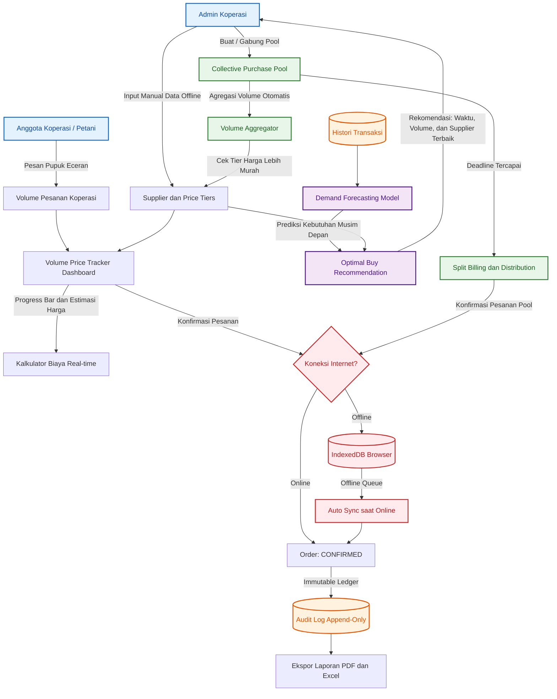

# Flowchart Diagram — VolumeMate

Dokumen ini menjelaskan alur kerja (workflow) utama dari platform VolumeMate, yang mencakup manajemen data, pelacakan harga, mesin rekomendasi AI, sistem pembelian kolektif, pencatatan transaksi aman, dan toleransi jaringan (offline mode).

---

## Alur Kerja Aplikasi (Application Flowchart)

Berikut adalah diagram flowchart yang menggambarkan interaksi pengguna dan proses sistem di dalam platform VolumeMate:

---

## Deskripsi Alur

1. **Modul Pelacakan Harga (Volume Price Tracker)**:
   * Admin Koperasi memasukkan data profil supplier dan struktur tier harga secara manual berdasarkan negosiasi offline.
   * Anggota koperasi (petani/toko gerai) melakukan pemesanan pupuk eceran ke koperasi.
   * Dasbor melacak total volume pesanan saat ini dan menunjukkan estimasi biaya real-time serta jarak volume yang dibutuhkan untuk mencapai tier harga berikutnya.

2. **VolumeMind AI Engine**:
   * Sistem menganalisis histori transaksi yang tersimpan di PostgreSQL.
   * Model demand forecasting memprediksi jumlah kebutuhan pupuk untuk musim tanam mendatang.
   * Berdasarkan prediksi kebutuhan dan data tier harga supplier, sistem memberikan rekomendasi pembelian optimal (kapan harus membeli, seberapa banyak volume, dan dari supplier mana).

3. **Pembelian Kolektif (Collective Buying Power)**:
   * Admin Koperasi dapat membuat atau bergabung dengan kelompok pembelian bersama (Cooperative Pool).
   * Volume pesanan dari beberapa koperasi digabungkan oleh sistem untuk memenuhi tier volume yang lebih tinggi agar mendapatkan harga per unit yang lebih murah.
   * Setelah batas waktu (deadline) tercapai, tagihan dibagi secara proporsional (split billing) kepada masing-masing koperasi yang berpartisipasi.

4. **Toleransi Jaringan (Offline Mode)**:
   * Sebelum pesanan dikirim, sistem mendeteksi status koneksi internet.
   * Jika tidak ada jaringan (offline), data pesanan disimpan sementara di penyimpanan lokal browser (IndexedDB).
   * Ketika koneksi internet pulih, service worker melakukan sinkronisasi otomatis untuk mengirimkan data antrean pesanan ke server backend.

5. **Keamanan dan Audit**:
   * Setiap pesanan yang dikonfirmasi akan dicatat ke dalam database dengan status yang tidak dapat diubah atau dihapus (immutable ledger).
   * Perubahan status pengiriman atau pembayaran dicatat secara append-only di dalam tabel Audit Log untuk menjaga transparansi.
   * Laporan transaksi bulanan/tahunan dapat diekspor ke format PDF atau Excel.
