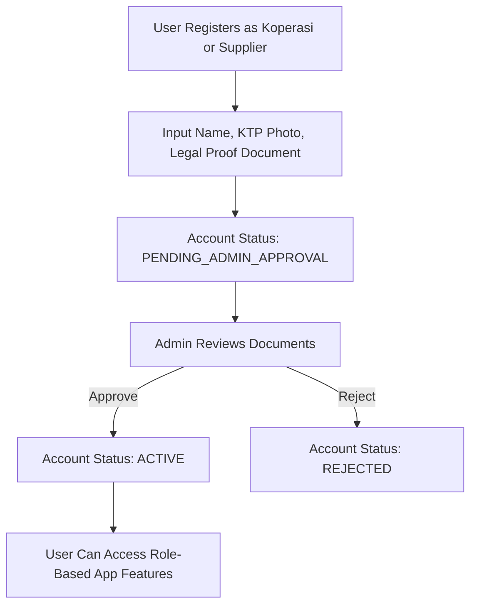
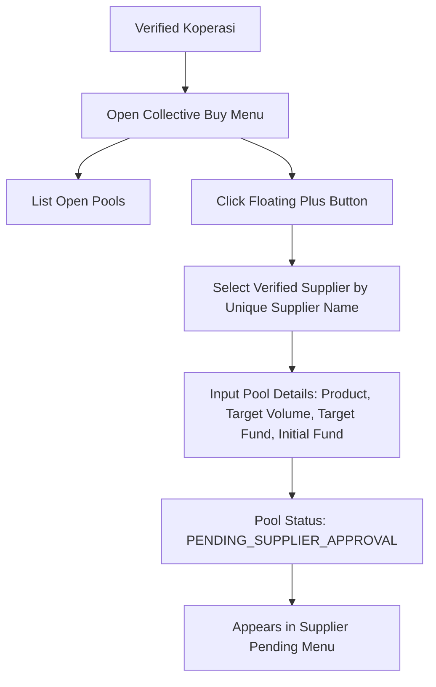
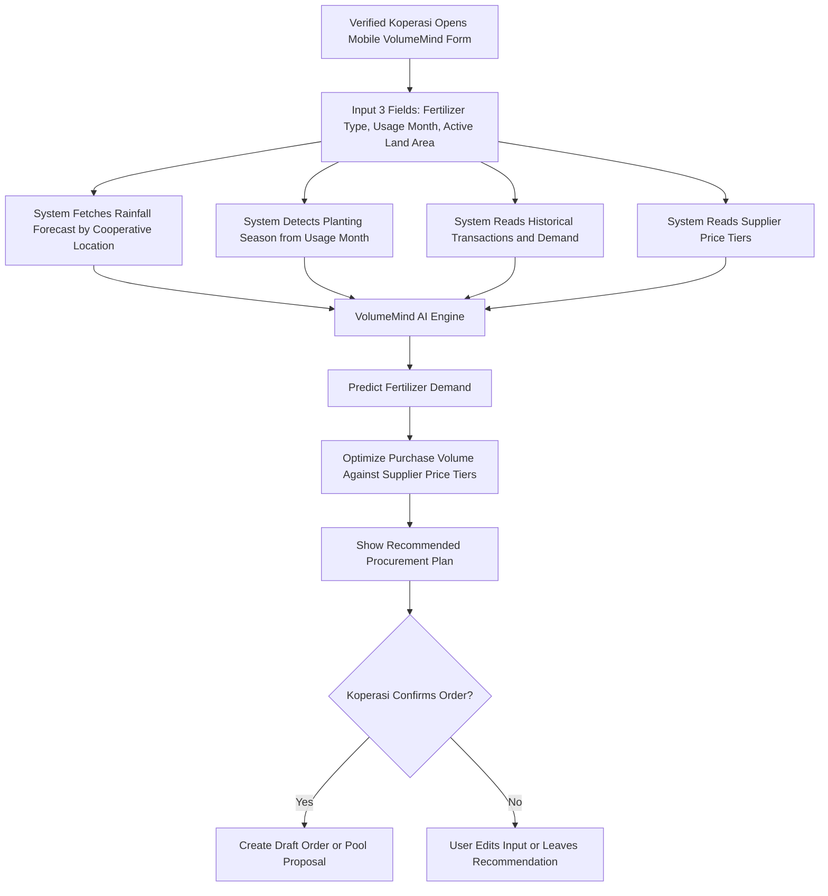
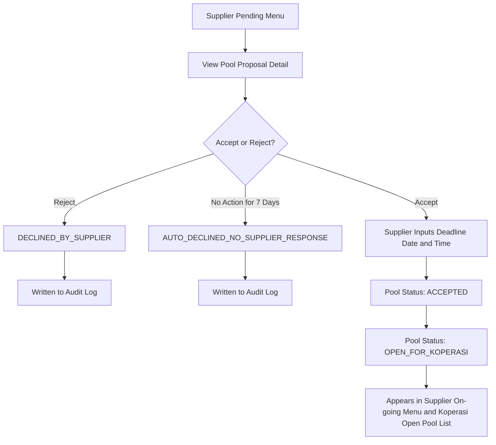
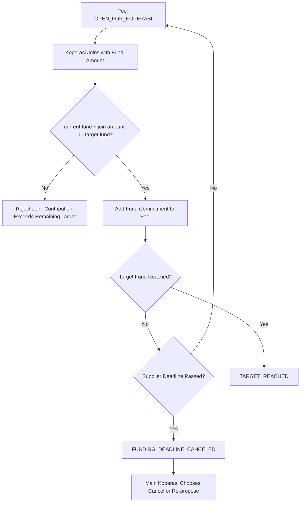
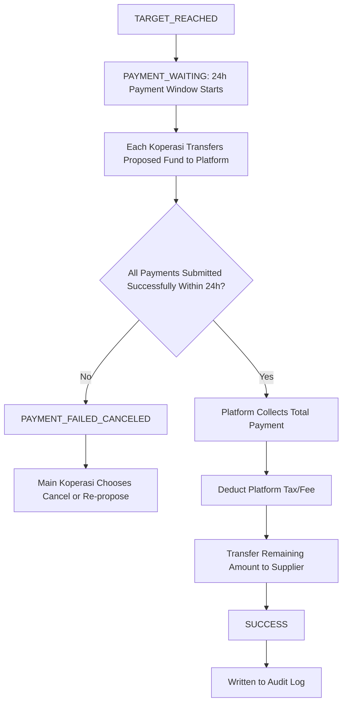
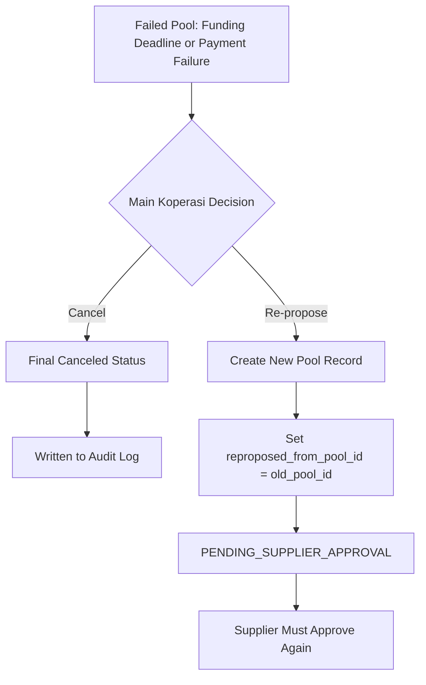
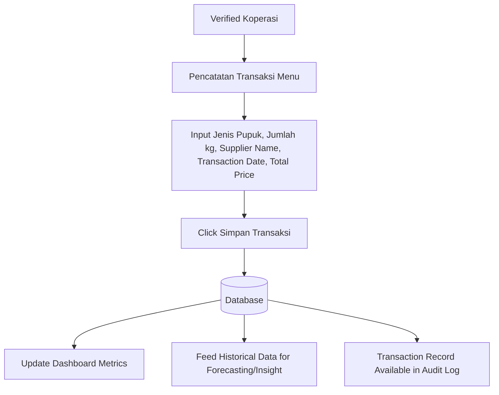
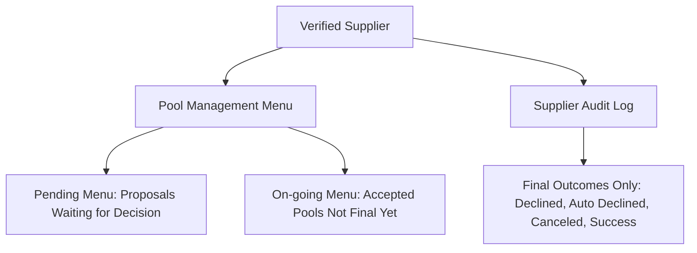

# Flowchart Diagram — VolumeMate Updated

This document describes the updated VolumeMate flow with:

- mobile-only web/PWA MVP direction,
- Admin manual approval for Koperasi and Supplier registration,
- Supplier active account,
- VolumeMind AI procurement recommendation,
- Koperasi pool proposal,
- Supplier accept/reject,
- Supplier deadline setting,
- open collective buying pool,
- 24-hour payment window,
- platform payout to Supplier minus platform tax/fee,
- audit log for final outcomes only.

---

## 1. Registration & Admin Verification Flow



---

## 2. Koperasi Collective Buy Flow



---

## 2a. VolumeMind AI Recommendation Flow



Recommended output fields:

```text
Selected supplier
Recommended quantity
Estimated total cost
Potential saving
Best order window
Recommendation reason
```

---

## 3. Supplier Pool Approval Flow



---

## 4. Join Pool & Funding Flow



---

## 5. Payment & Supplier Payout Flow



---

## 6. Re-propose Flow



---

## 7. Manual Transaction Recording Flow



---

## 8. Supplier Menu Flow



---

## 9. Pool Status Meaning

| Status | Meaning | Audit Log? |
|---|---|---|
| `PENDING_SUPPLIER_APPROVAL` | Pool proposal waits for supplier decision | No |
| `DECLINED_BY_SUPPLIER` | Supplier rejected the proposal | Yes |
| `AUTO_DECLINED_NO_SUPPLIER_RESPONSE` | Supplier did not act within 7 days | Yes |
| `ACCEPTED` | Supplier approved and set deadline | No |
| `OPEN_FOR_KOPERASI` | Other cooperatives can join | No |
| `TARGET_REACHED` | Target fund has been reached | No |
| `PAYMENT_WAITING` | 24-hour payment window is active | No |
| `FUNDING_DEADLINE_CANCELED` | Target fund not reached before deadline | Yes |
| `PAYMENT_FAILED_CANCELED` | At least one participant did not pay within 24h | Yes |
| `SUCCESS` | All payments submitted and supplier payout processed | Yes |
