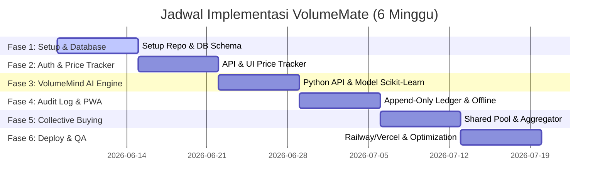

# Rencana Implementasi (Implementation Plan) — VolumeMate
**Panduan Pengerjaan Langkah-demi-Langkah (Step-by-Step Execution Guide)**

Rencana implementasi ini dirancang selama **6 minggu** untuk menghadirkan Minimum Viable Product (MVP) yang kokoh, fungsional, dan sesuai dengan target output 6 bulan pertama.

---

## Diagram Fase Kerja (Gantt Chart Sederhana)


---

## Detail Setiap Fase

### Struktur Workspace Mono-Repo
Untuk mempermudah manajemen kode, proyek akan menggunakan struktur mono-repo sederhana:
```text
volumemate/
├── apps/
│   ├── frontend/         # React.js (Vite) + Chart.js
│   ├── backend/          # NestJS (Node.js) + Prisma
│   └── ai-engine/        # Python REST microservice + scikit-learn
├── docker-compose.yml    # Development database & services
└── README.md
```

---

### Fase 1: Project Setup & Database Schema Design (Minggu 1)
Fokus pada inisialisasi semua sub-proyek dan perancangan skema database relasional.

#### **Backend (NestJS)**
* Inisialisasi proyek NestJS menggunakan TypeScript.
* Pasang Prisma ORM dan hubungkan ke database PostgreSQL.
* Buat modul inti: `PrismaModule`, `UsersModule`, `SupplierModule`, `OrderModule`.

#### **Database (PostgreSQL Schema)**
Rancang tabel utama dengan relasi berikut:
* `User` & `Koperasi`: Informasi profil pengguna dan asosiasi koperasi mereka.
* `Supplier` & `Product`: Katalog produk pupuk dari berbagai supplier.
* `PriceTier`: Menyimpan relasi volume-to-price (contoh: `min_volume`, `max_volume`, `price_per_kg`).
* `Order` & `OrderItem`: Pencatatan transaksi pemesanan.
* `CollectivePool`: Menyimpan grup pemesanan bersama yang aktif.

#### **Frontend (React)**
* Inisialisasi React menggunakan Vite, TypeScript, dan Vanilla CSS.
* Setup router menggunakan React Router DOM.
* Setup pustaka UI dasar (icon, fonts).

---

### Fase 2: Autentikasi & Volume Price Tracker (Minggu 2)
Membangun modul manajemen pengguna dan fitur utama visualisasi harga.

#### **Backend (NestJS)**
* Implementasi autentikasi pengguna lengkap dengan manajemen hak akses: `ADMIN_KOPERASI`, `ANGGOTA`.
* API endpoints untuk CRUD Supplier, Product, dan PriceTier (dikelola oleh Admin).
* API endpoints untuk menghitung estimasi harga dinamis berdasarkan kuantitas pesanan.

#### **Frontend (React)**
* Halaman Login & Registrasi Koperasi.
* **Volume Price Tracker Dashboard**:
  * Implementasi Chart.js untuk menampilkan kurva tier harga supplier secara visual.
  * Komponen *Progress Bar* interaktif yang menunjukkan sisa volume yang dibutuhkan untuk mencapai tier harga murah berikutnya.
  * Kalkulator estimasi biaya pesanan *real-time*.

---

### Fase 3: VolumeMind AI Engine Implementation (Minggu 3)
Membangun kecerdasan buatan berbasis microservice terpisah.

#### **AI Engine (Python)**
* Inisialisasi Python REST server.
* Integrasikan `scikit-learn`, `pandas`, dan `numpy`.
* **Demand Forecasting Model**:
  * Buat algoritma regresi sederhana untuk memprediksi kebutuhan pupuk berdasarkan variabel: bulan/musim tanam, curah hujan (dummy data), dan histori pembelian koperasi.
* **Optimal Buy Algorithm**:
  * Buat fungsi optimasi linear untuk mencari supplier mana yang menawarkan kombinasi biaya termurah berdasarkan tier volume.
* Ekspos 2 endpoint REST: `/predict` dan `/recommend`.

#### **Backend (NestJS)**
* Buat `VolumeMindService` yang bertugas melakukan HTTP call ke Python AI Engine.
* Buat worker terjadwal (cron job) untuk melakukan pembaruan forecast mingguan.

---

### Fase 4: Supplier Audit Log & Offline Resilience (Minggu 4)
Menjamin integritas data transaksi dan adaptasi kondisi jaringan buruk di pedesaan.

#### **Backend (NestJS)**
* Implementasi transaksi bersifat **immutable** (tidak boleh ada operasi `UPDATE` atau `DELETE` pada tabel `Order` setelah statusnya `CONFIRMED`).
* Setiap perubahan data status logistik/pembayaran dicatat di tabel `AuditLog` (skema *append-only*).
* Integrasi PDF generation (`pdfkit`) dan Excel generation (`exceljs`) untuk laporan transaksi koperasi.

#### **Frontend (React - PWA)**
* Konfigurasi Vite PWA plugin untuk registrasi service worker.
* Implementasi caching strategi `Stale-While-Revalidate` untuk data katalog supplier dan profil koperasi.
* Penambahan indikator status jaringan (Online/Offline) pada header aplikasi.
* Mekanisme antrean pengiriman lokal (*Offline Queue*) menggunakan IndexedDB (lokal database browser) untuk menyimpan pesanan saat offline dan disinkronisasi otomatis saat online kembali.

---

### Fase 5: Collective Buying Power (Minggu 5)
Mengintegrasikan fitur kolaborasi antar-koperasi desa.

#### **Backend (NestJS)**
* Modul `CollectivePool`:
  * Endpoint membuat pool baru untuk tipe pupuk tertentu dengan batas tenggat waktu (*deadline*).
  * Endpoint bagi koperasi lain untuk bergabung ke pool tersebut.
  * Logika otomatisasi: ketika total volume pool bertambah, cari kecocokan tier harga supplier secara real-time dan perbarui estimasi harga bagi semua partisipan.
* Logika pembagian tagihan (*split billing*) proporsional.

#### **Frontend (React)**
* Halaman eksplorasi pool pembelian bersama yang sedang aktif.
* Widget visualisasi kontribusi volume per-koperasi terhadap pencapaian target tier harga.
* UI pembuatan pool baru dengan parameter jenis pupuk dan tanggal penutupan.

---

### Fase 6: Deployment, Optimasi, & QA (Minggu 6)
Peluncuran produk ke server produksi dan pengujian performa.

#### **Deployment Setup**
* **Frontend**: Dideploy ke Vercel dengan konfigurasi routing SPA (`vercel.json`).
* **Backend API & Database**: Deploy NestJS dan PostgreSQL di Railway.
* **AI Engine**: Deploy Python REST microservice ke Railway.

#### **Optimasi & Pengujian**
* **Lighthouse Audit**: Pastikan nilai Performance $\ge 90$ terutama pada simulasi jaringan 3G.
* **Security Check**: Uji keandalan otorisasi akses (memastikan role `ANGGOTA` tidak bisa memanipulasi data tier harga).
* **AI Validation**: Lakukan backtesting pada model demand forecasting dengan histori transaksi simulasi untuk memvalidasi akurasi target $\ge 80\%$.
