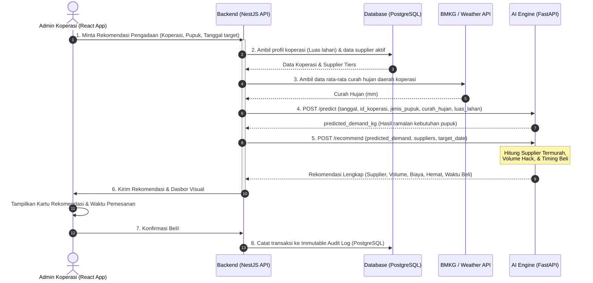

# 🌿 VolumeMate: Alur Integrasi AI di Dunia Nyata (Real-World Use Case)
**Bagaimana VolumeMind AI Bekerja dari Hulu ke Hilir di Aplikasi Produksi**

Dokumen ini menjelaskan alur interaksi data akhir (*end-to-end workflow*) antara pengguna, frontend, backend NestJS, database, dan AI Engine di aplikasi nyata.

---

## 1. Diagram Alur Sistem (System Architecture Flow)

Berikut adalah bagaimana data mengalir saat Admin Koperasi menekan tombol di aplikasi:

---

## 2. Alur Penggunaan Nyata Langkah-demi-Langkah (Real-World Steps)

### Langkah 1: Input Pengguna di Dasbor (Frontend React)
Admin Koperasi Sumber Makmur membuka aplikasi PWA VolumeMate di HP/komputernya:
*   Admin memilih jenis pupuk: **"Pupuk NPK Phonska"**.
*   Admin memilih tanggal target penggunaan pupuk: **Oktober 2026** (karena bersiap menghadapi awal musim tanam Rendengan).
*   Admin klik tombol **"Hitung Pengadaan Optimal"**.

### Langkah 2: Pengambilan Data Otomatis (Backend NestJS)
Backend NestJS menerima request tersebut dan bekerja di balik layar:
1.  **Mengambil Data Lahan**: Mengambil total luas lahan aktif milik anggota Koperasi Sumber Makmur dari database PostgreSQL (misal: 500 Hektar).
2.  **Mengambil Data Cuaca**: Memanggil API cuaca BMKG/OpenWeatherMap untuk mengambil estimasi curah hujan di wilayah koordinat koperasi pada bulan Oktober (misal: 300 mm).
3.  **Mengambil Data Supplier**: Mengambil data daftar supplier pupuk aktif beserta tier harganya dari database.

### Langkah 3: Eksekusi Model AI (FastAPI / `/predict`)
NestJS mengirimkan data tersebut ke AI Engine (FastAPI):
*   FastAPI memuat model `demand_forecasting_model.joblib`.
*   Model membaca bahwa di bulan **Oktober** (musim tanam **Rendengan**) dengan curah hujan **300 mm** dan lahan **500 Hektar**, Koperasi Sumber Makmur secara historis membutuhkan sekitar **9.500 kg** pupuk NPK.
*   FastAPI mengembalikan angka **9.500 kg** ke NestJS.

### Langkah 4: Optimasi Biaya & Waktu (FastAPI / `/recommend`)
NestJS mengirimkan angka 9.500 kg tersebut beserta daftar supplier ke endpoint `/recommend` di FastAPI:
*   AI menghitung bahwa supplier **PT Petrokimia** adalah yang termurah dengan harga Rp 9.200/kg.
*   **Perhitungan Volume Hack**: AI mendeteksi bahwa jika koperasi membulatkan pembelian ke **10.000 kg**, harga per kg turun menjadi Rp 8.500/kg (Total biaya turun dari Rp 87,4 juta menjadi Rp 85 juta).
*   **Perhitungan Timing**: AI mendeteksi bahwa total pesanan besar (10 ton), sehingga menyarankan pemesanan dilakukan **2 bulan lebih cepat (Agustus/September)** untuk memesan slot truk logistik dan menghindari antrean gudang supplier.

### Langkah 5: Tampilan Dasbor yang Actionable (Frontend React)
Admin melihat rekomendasi di layar HP-nya dengan jelas:
> 💡 **Rekomendasi VolumeMind AI:**
> *   **Prediksi Kebutuhan Anggota**: 9.500 kg NPK.
> *   **Saran Pembelian**: Beli **10.000 kg** (Volume Hack aktif - hemat Rp 2,4 juta daripada beli 9.500 kg).
> *   **Supplier Terpilih**: PT Petrokimia Gresik.
> *   **Waktu Pemesanan Terbaik**: Pesan antara bulan **Agustus hingga September 2026** (1-2 bulan sebelum target penggunaan Oktober) demi kelancaran pengiriman logistik.

### Langkah 6: Eksekusi Transaksi Aman
Jika Admin setuju, dia menekan tombol **"Konfirmasi Pemesanan"**:
*   Sistem mencatat transaksi ini ke tabel database PostgreSQL dengan status **Immutable** (tidak bisa diubah atau dihapus) untuk mencegah manipulasi keuangan koperasi oleh pengurus nakal.
*   Log transaksi otomatis masuk ke **Supplier Audit Log** yang siap diekspor menjadi laporan pertanggungjawaban PDF untuk rapat tahunan anggota koperasi.
