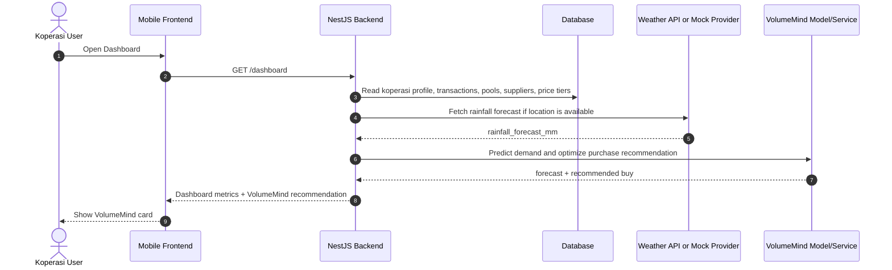

# VolumeMind Integration Flow — VolumeMate

VolumeMind is the AI recommendation layer for VolumeMate.

Important product rule:

```text
VolumeMind is shown only on Koperasi Dashboard.
```

There is no separate AI menu and no standalone AI input form in the current MVP.

---

## 1. User Experience

Koperasi opens the mobile Dashboard and sees a VolumeMind card.

The user does not manually enter AI parameters such as fertilizer type, target month, rainfall, or land size on a separate page.

The Dashboard card should show a concise recommendation:

```text
Prediksi Kebutuhan Bulan Depan
Rekomendasi Pemasok
Kuantitas Optimal
Estimasi Biaya
Potensi Penghematan
Akurasi Prediksi
Konfirmasi Pemesanan
```

If data is insufficient:

```text
Data belum cukup untuk rekomendasi AI. Tambahkan transaksi atau data lahan terlebih dahulu.
```

---

## 2. Data Sources

VolumeMind reads data from database/system sources:

```text
Koperasi profile
Koperasi location
member/active land data if available
manual transaction records
collective-buy pool history
final pool outcomes
verified supplier data
supplier price tiers
rainfall forecast from BMKG/OpenWeather/mock provider
planting season inferred from month/location
```

The frontend does not collect these values through a dedicated AI form.

---

## 3. Backend Flow



---

## 4. Recommended Backend Output

The frontend currently expects a field similar to:

```json
{
  "akurasiPrediksi": 94,
  "rekomendasiVolumeMind": {
    "supplierName": "PT Agro Nusa",
    "angka_kg": 12500,
    "totalCost": 68750000,
    "savingsRp": 4200000,
    "bulan_1": "Bulan Depan",
    "explanation": "Pembelian 12.5 ton mencapai tier harga lebih murah.",
    "isVolumeHack": true
  }
}
```

Recommended future normalized shape:

```json
{
  "volumeMind": {
    "forecastedDemandKg": 9500,
    "recommendedPurchaseKg": 10000,
    "selectedSupplierName": "PT Petrokimia Gresik",
    "estimatedTotalCost": 85000000,
    "estimatedSaving": 2400000,
    "bestOrderWindow": "Agustus - September 2026",
    "accuracy": 94,
    "reason": "Target 10 ton mencapai tier grosir supplier."
  }
}
```

---

## 5. Model Responsibilities

VolumeMind performs two background calculations:

### 5.1 Demand Forecast

Predict upcoming fertilizer need based on stored Koperasi data:

```text
historical manual transactions
historical pool outcomes
seasonality
rainfall forecast
land/profile data if available
```

### 5.2 Recommended Buy Optimization

Compare forecasted demand against supplier price tiers.

Example:

```text
Forecast demand: 9,500 kg NPK
Supplier discount tier: 10,000 kg
Recommendation: buy 10,000 kg
Reason: total cost is lower despite buying more volume
```

---

## 6. Frontend Rule

VolumeMind UI belongs to:

```text
frontend/src/screens/KoperasiDashboardScreen.tsx
```

Do not add:

```text
VolumeMind menu
AI input page
AI wizard
manual forecast form
```

The only user action currently planned from the Dashboard card is:

```text
Konfirmasi Pemesanan
```

For MVP, this can create a draft order/proposal or trigger a placeholder notice until backend flow is finalized.
